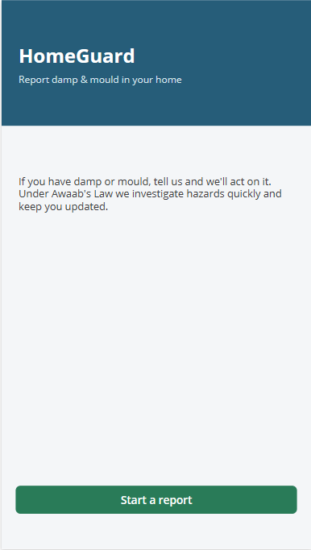
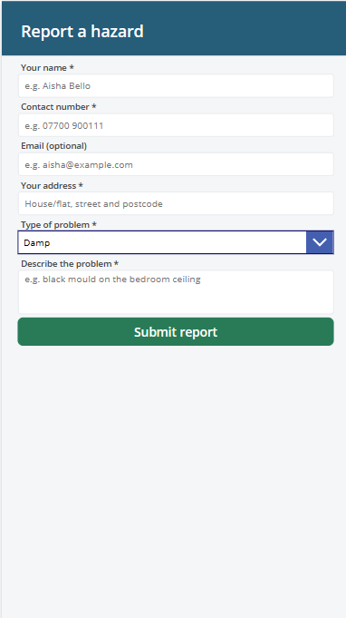
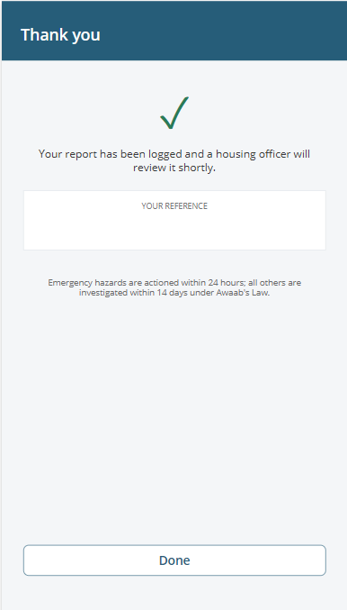
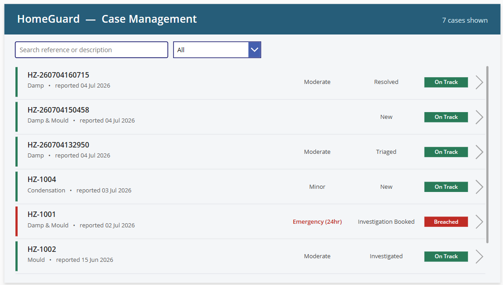
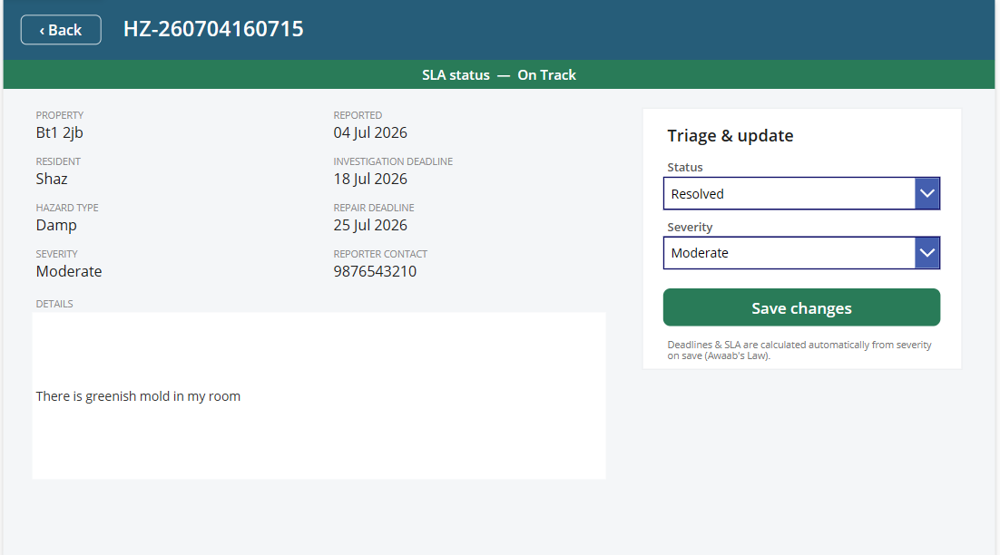
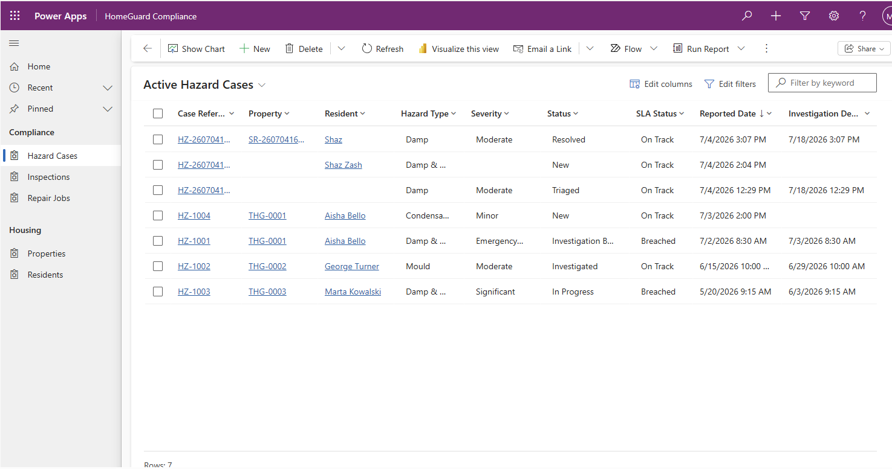
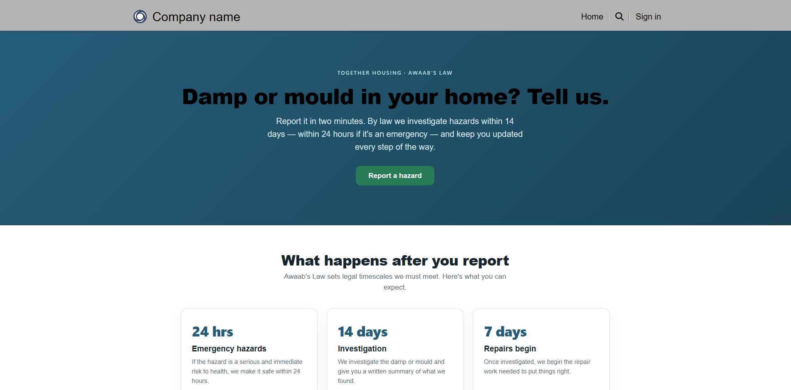
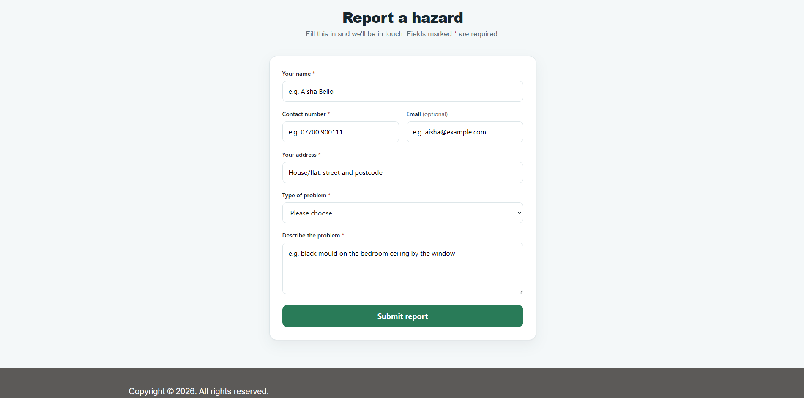

# HomeGuard — Damp & Mould Compliance on the Power Platform

A social-housing damp & mould management solution built around **Awaab's Law**, the UK legislation requiring social landlords to investigate reported hazards within **14 days** (24 hours if an emergency) and begin repairs within **7 days**.

Residents report a hazard → officers triage it → the statutory deadlines are calculated and tracked automatically. Built on **Microsoft Power Platform & Dataverse**.

---

## What's in it

| Component | Technology | Audience | Purpose |
|---|---|---|---|
| **Data model** | Dataverse (5 tables) | — | Relational schema for the whole solution |
| **Report a Hazard** | Canvas app (phone) | Residents | Validated intake form; creates Property + Resident + Case, linked |
| **HomeGuard Officer** | Canvas app (tablet) | Housing officers | Colour-coded case list + triage screen with the Awaab's Law engine |
| **HomeGuard Compliance** | Model-driven app | Housing officers | Enterprise case management — sectioned forms, curated views |
| **HomeGuard portal** | Power Pages | Public / residents | Public website: Awaab's Law info + a report form that saves to Dataverse |

## Screenshots

### Resident app — "Report a Hazard"

| Welcome | Report form | Confirmation |
|---|---|---|
|  |  |  |

### Officer app — "HomeGuard Officer"

Colour-coded SLA case list — breached cases and emergencies flagged in red:



Case detail with the Awaab's Law triage panel:



### Model-driven app — "HomeGuard Compliance"



### Power Pages portal (public)





## Data model

```
Property ──┬── Resident ──┐
           │              ├──► Hazard Case ──┬──► Inspection
           └──────────────┘   (severity,     └──► Repair Job
                                deadlines, SLA)
```

Five related tables (`hg_` prefix), ~40 columns, 7 choice sets.

## The Awaab's Law engine

When an officer triages a case (sets its **Severity**), the app automatically calculates and stores:

| Severity | Investigation deadline | Repair deadline |
|---|---|---|
| Emergency (24hr) | reported **+ 24 hours** | + 7 days |
| Anything else | reported **+ 14 days** | + 7 days |

…and derives the **SLA RAG status** (On Track / At Risk / Breached) from the current date against those deadlines.

## Key features

- **Relational data model** linking properties, residents, hazard cases, inspections and repair jobs
- **Resident intake** with field validation and record linking
- **Officer case management** — colour-coded SLA list (breached cases flagged red), triage and status updates
- **Automated Awaab's Law timescales** — investigation and repair deadlines plus live RAG status
- **Public Power Pages portal** so residents can report a hazard over the web
- **Model-driven app** with organised forms, curated views and dashboards

## Repository layout

```
HomeGuard/
├─ solution/    Dataverse solution (tables, model-driven app)
├─ canvas/src/  "Report a Hazard" resident app
├─ officer/src/ "HomeGuard Officer" app
├─ pages/       Power Pages site (web pages, templates, settings)
├─ docs/        Notes & guides
└─ src/         Dataverse solution project
```

## Tech stack

`Microsoft Dataverse` · `Power Apps (canvas + model-driven)` · `Power Pages` · `Power Fx`

---

Built by **Muhammed Shazin Sadhik Kunhi Parambath** as a Power Platform portfolio project.
